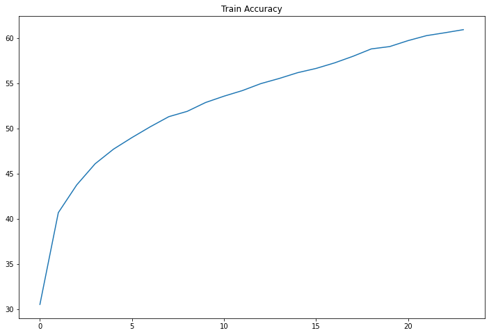
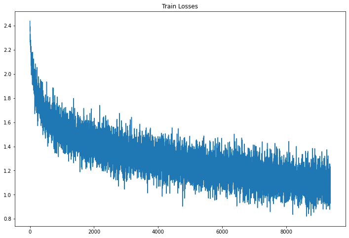
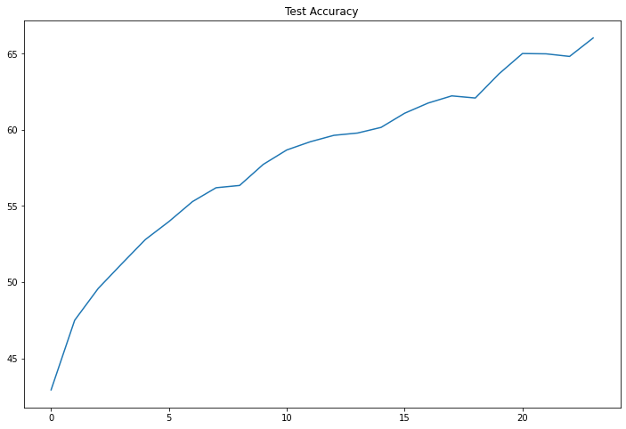
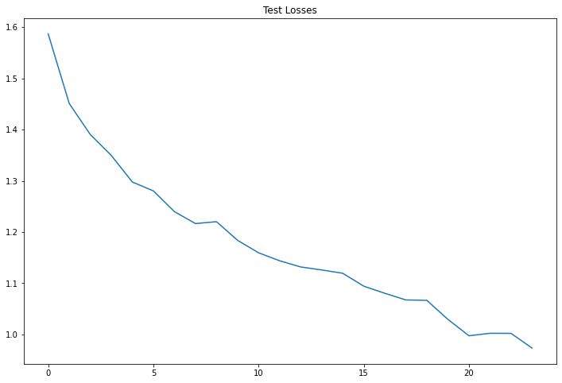
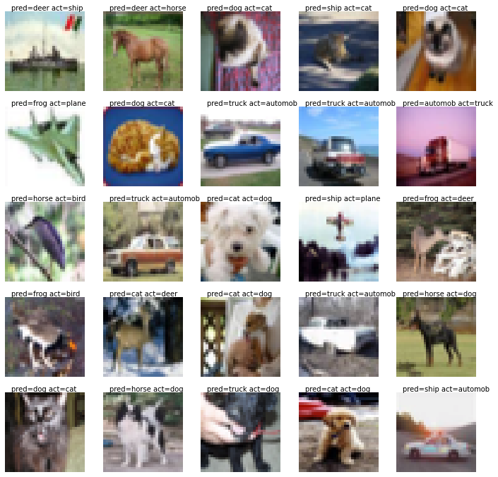

**Student of EVA7 Batch awaiting EVA Phase II submitting EVA8 Transformer Assignments**  
Repository github url : https://github.com/jai-mr/Session  
Assignment Repository : https://github.com/jai-mr/Session/blob/main/S10/README.md 
Submitted by : Jaideep R - No Partners 
Registered email id : jaideepmr@gmail.com 

**Objective:*** 
Re-writing the network as in link such that it is similar to the network we wrote in the class 
	https://github.com/kentaroy47/vision-transformers-cifar10/blob/main/models/vit.py

	i. All parameters are the same as the network we wrote
	ii. Proceed to submit the assignment:
	iii. Share the model code and link to the model cost
	iv. Share the training logs
	v.Share the gradcam images for 10 misclassified images

1. **Model10.py Link** 
[Model File](https://github.com/jai-mr/Session/blob/main/S10/src/models.py)

2. **Jupyter Notebook** 
[Jupyter Notebook](https://github.com/jai-mr/Session/blob/main/S10/S10.ipynb)

3. **Model Parameters** 
[File Link](https://github.com/jai-mr/Session/blob/main/S10/log/TotalParam.md)`

4. **Training Log** 
[File Link](https://github.com/jai-mr/Session/blob/main/S10/log/log.md)

5. Training Details 
i.    
ii.   >
iii.  
iv.   

5. **Misclassified Images** 

