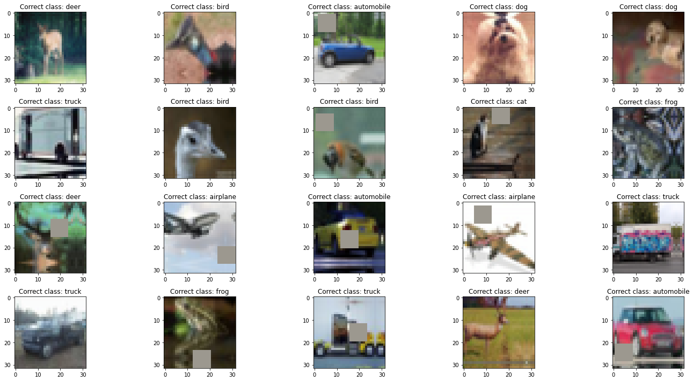
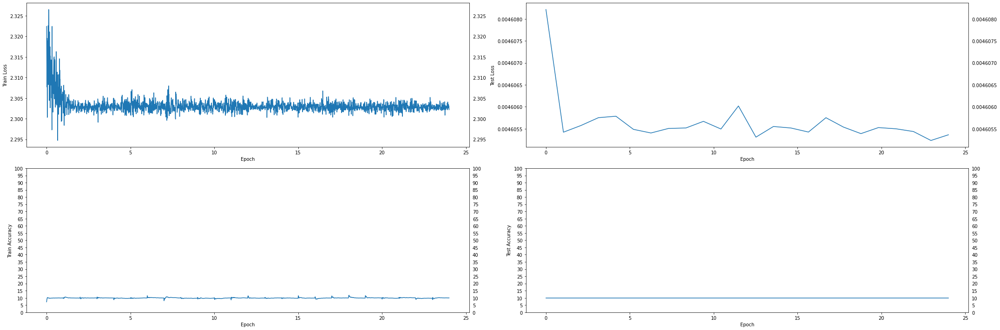
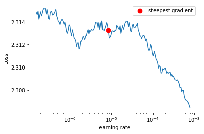
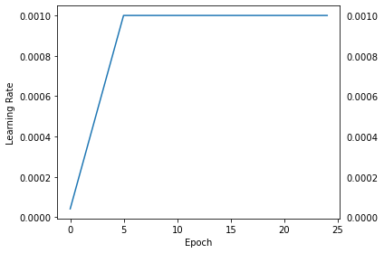
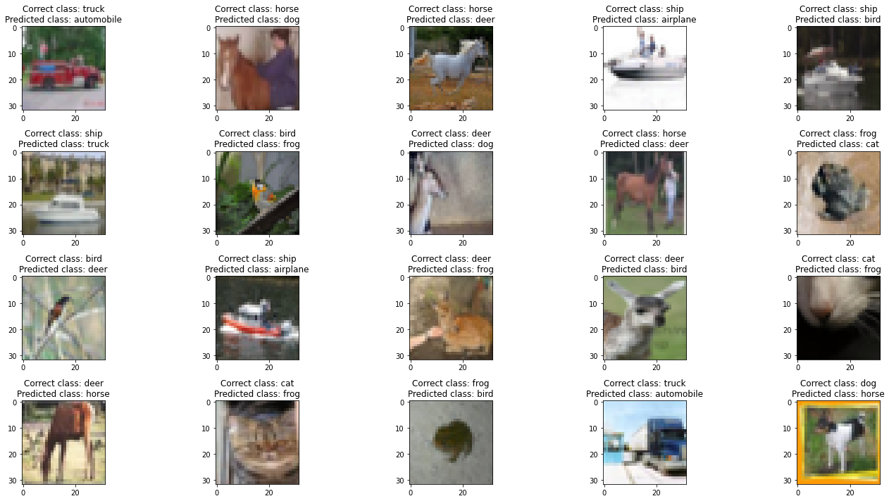

**Student of EVA7 Batch awaiting EVA Phase II submitting EVA8 Transformer Assignments** </br>
Repository github url : https://github.com/jai-mr/Session </br>
Assignment Repository : https://github.com/jai-mr/Session/blob/main/S10/README.md</br>
Submitted by : Jaideep R - No Partners</br>
Registered email id : jaideepmr@gmail.com</br>

**Objective:***</br>
Re-writing the network as in link such that it is similar to the network we wrote in the class
	https://github.com/kentaroy47/vision-transformers-cifar10/blob/main/models/vit.py

	 i. All parameters are the same as the network we wrote
	ii. Proceed to submit the assignment:
   iii. Share the model code and link to the model cost
    iv. Share the training logs
     v.Share the gradcam images for 10 misclassified images


1. **Model10.py Link**</br>
[Model10.py](https://github.com/jai-mr/Session/blob/main/S10/src/models/model10.py)

2. **Jupyter Notebook**</br>
[Jupyter Notebook](https://github.com/jai-mr/Session/blob/main/S10/E8S10.ipynb)


3. **Model Parameters**</br>
```

```

4. **Training Log**</br>
```

```

5. Training Details</br>
i.   
ii.  Epochs = 
iii. Max LR = 
iv.  Min LR = 

6. **Training and Validation Loss Chart**</br>


7. **LR Finder Graph**</br>


8. **LR History**</br>


9. **Misclassified Images**</br>

