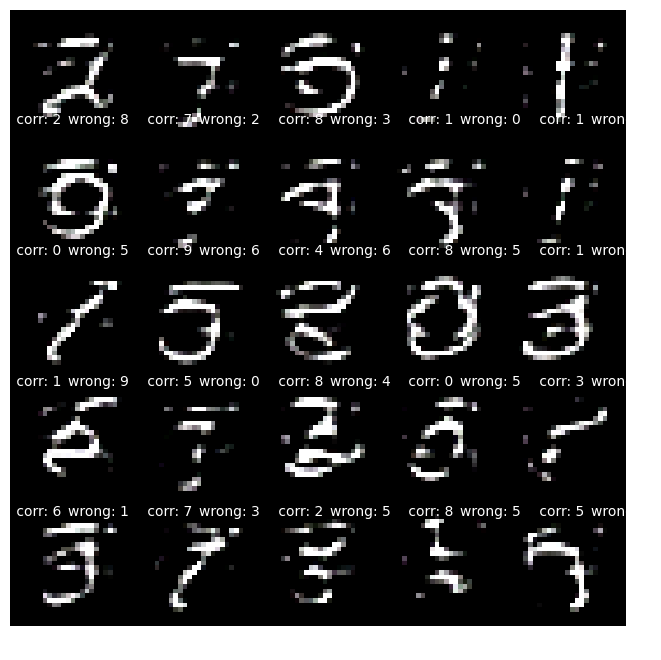

**Student of EVA7 Batch awaiting EVA Phase II submitting EVA8 Transformer Assignments**  
Repository github url : https://github.com/jai-mr/Session  
Assignment Repository : https://github.com/jai-mr/Session/blob/main/S13/README.md  
Submitted by : Jaideep R - No Partners 
Registered email id : jaideepmr@gmail.com 

**1. VAE - MNIST** 

**A. Design a variation of a VAE in Pytorch that takes in two inputs** 
i. an MNIST image, and 
ii. its label which is an one hot encoded vector sent through an embedding layer 
**B. Training as you would train a VAE** 
**C. Now randomly send an MNIST image, but with a wrong label. Do this 25 times, and share what the VAE makes i.e 25 images stacked in 1 image** 

- [VAE MNIST Implementation - Jupyter Notebook url](https://github.com/jai-mr/Session/blob/main/S13/1_s13_vae_mnist.ipynb) 
- VAE-MNIST Output 
 

**2. VAE - CIFAR10** 

**A. Design a variation of a VAE in Pytorch that takes in two inputs** 
1. a cifar10  image, and 
2. its label which is an one hot encoded vector sent through an embedding layer 
**B. Training as you would train a VAE** 
**C. Now randomly send an cifar10 image, but with a wrong label. Do this 25 times, and share what the VAE makes i.e 25 images stacked in 1 image** 

- [VAE Cifar10 Implementation - Jupyter Notebook url](https://github.com/jai-mr/Session/blob/main/S13/2_s13_vae_cifar10.ipynb) 
- VAE - Cifar10 
 

**3. UNET - Oxfordiiit-pet-dataset** 

**A. train your own UNet from scratch** 
**B. using the dataset https://www.kaggle.com/tanlikesmath/the-oxfordiiit-pet-datase**t  
**C. strategy provided in this link https://medium.com/geekculture/u-net-implementation-from-scratch-using-tensorflow-b4342266e406** 
**D. train it 4 times** 
i. MP+Tr+BCE 
ii. MP+Tr+Dice Loss 
iii. StrConv+Tr+BCE 
iv. StrConv+Ups+Dice Loss 

**DELETE BELOW**
#### Downloaded files
- [yolov3.weights](https://drive.google.com/file/d/1n_goSSxtYNFhKCEGR6GRkN8fmbX-rOjH/view?usp=share_link)
- [yolov3.cfg](https://drive.google.com/file/d/18KDbkH2435Bt9BqV2-rPH6XOiexnP-Yp/view?usp=share_link)
- [Class names - coco.names](https://drive.google.com/file/d/1nJVVGHu8dnVJ-6lMLAeqGnJy7O0F1Kox/view?usp=share_link)

#### Link to YOLOv3OpenCV code on Github 
[Github Link for jupyter notebook](https://github.com/jai-mr/Session/blob/main/S12/S12_1/12_1_Assignment_Yolo3.ipynb)

#### Link to the image annotated by OpenCV YOLO inference</>
[Original Image Link](image/Self_1.jpeg) 
[Annotated Image by Open CV Yolo inference](image/Self_1_bb.png)

 
