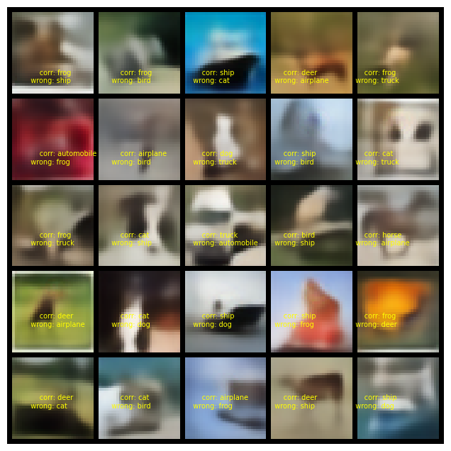

**Student of EVA7 Batch awaiting EVA Phase II submitting EVA8 Transformer Assignments**  
Repository github url : https://github.com/jai-mr/Session  
Assignment Repository : https://github.com/jai-mr/Session/blob/main/S13/README.md  
Submitted by : Jaideep R - No Partners 
Registered email id : jaideepmr@gmail.com 

**1. VAE - MNIST** 

**A. Design a variation of a VAE in Pytorch that takes in two inputs** 
i. an MNIST image, and 
ii. its label which is an one hot encoded vector sent through an embedding layer 
**B. Training as you would train a VAE** 
**C. Now randomly send an MNIST image, but with a wrong label. Do this 25 times, and share what the VAE makes i.e 25 images stacked in 1 image** 

- [VAE MNIST Implementation - Jupyter Notebook url](https://github.com/jai-mr/Session/blob/main/S13/1_s13_vae_mnist.ipynb) 
- VAE-MNIST Output 
 

**2. VAE - CIFAR10** 

**A. Design a variation of a VAE in Pytorch that takes in two inputs** 
1. a cifar10  image, and 
2. its label which is an one hot encoded vector sent through an embedding layer 
**B. Training as you would train a VAE** 
**C. Now randomly send an cifar10 image, but with a wrong label. Do this 25 times, and share what the VAE makes i.e 25 images stacked in 1 image** 

- [VAE Cifar10 Implementation - Jupyter Notebook url](https://github.com/jai-mr/Session/blob/main/S13/2_s13_vae_cifar10.ipynb) 

- VAE - Cifar10 
 

**3. UNET - Oxfordiiit-pet-dataset** 

**A. train your own UNet from scratch** 
**B. using the dataset https://www.kaggle.com/tanlikesmath/the-oxfordiiit-pet-datase**t  
**C. strategy provided in this link https://medium.com/geekculture/u-net-implementation-from-scratch-using-tensorflow-b4342266e406** 
**D. train it 4 times** 

i. MP+Tr+BCE 
 [Training Log](https://github.com/jai-mr/Session/blob/main/S13/logs/3_s13_Unet_MpTrBce.log) 
 [Jupyter notebook link](https://github.com/jai-mr/Session/blob/main/S13/3_s13_Unet_MpTrBce.ipynb) 
 
ii. MP+Tr+Dice Loss 
 [Training Log](https://github.com/jai-mr/Session/blob/main/S13/logs/4_s13_Unet_MpTrDice.log) 
 [Jupyter notebook link](https://github.com/jai-mr/Session/blob/main/S13/4_s13_Unet_MpTrDice.ipynb) 
 
iii. StrConv+Tr+BCE 
 [Training Log](https://github.com/jai-mr/Session/blob/main/S13/logs/5_s13_UNet_StrTrBce.log) 
 [Jupyter notebook link](https://github.com/jai-mr/Session/blob/main/S13/5_s13_UNet_StrTrBce.ipynb) 
 
iv. StrConv+Ups+Dice Loss 
 [Training Log](https://github.com/jai-mr/Session/blob/main/S13/logs/6_s13_UNet_StrUpsDice.log) 
 [Jupyter notebook link](https://github.com/jai-mr/Session/blob/main/S13/6_s13_UNet_StrUpsDice.ipynb) 
