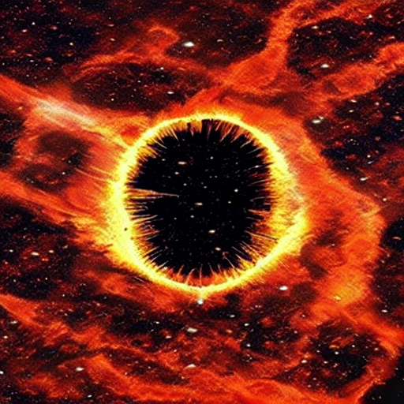
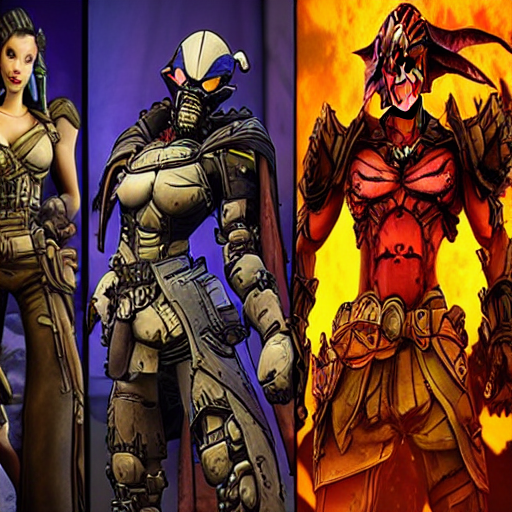
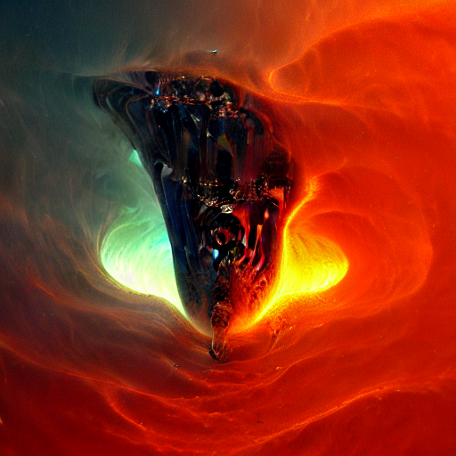
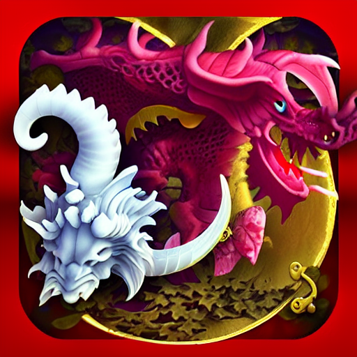
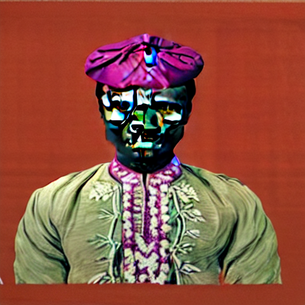
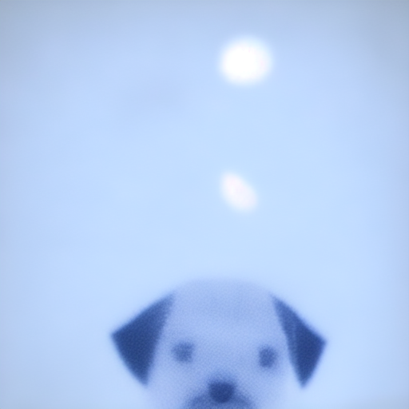
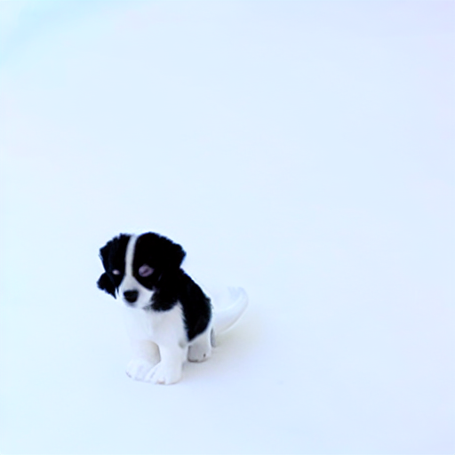
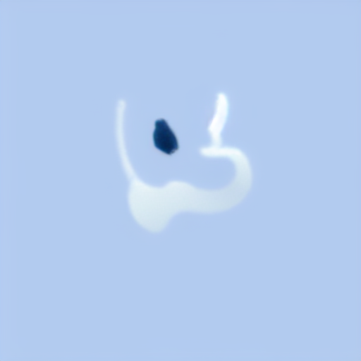
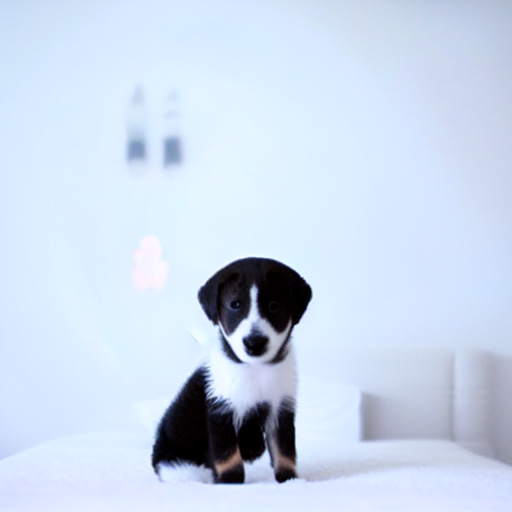

**Student of EVA7 Batch awaiting EVA Phase II submitting EVA8 Transformer Assignments** </br>
Repository github url : https://github.com/jai-mr/Session </br>
Assignment Repository : https://github.com/jai-mr/Session/blob/main/S14/README.md </br>
Submitted by : Jaideep R - No Partners</br>
Registered email id : jaideepmr@gmail.com</br>
**Objective:**</br> 

* Read the textual inversion section on [link](https://github.com/fastai/diffusion-nbs/blob/master/Stable%20Diffusion%20Deep%20Dive.ipynb) page. 
* There's a mention of "community-created SD concepts library" and download of learned_embeds.bin file. 
* There is also a mention of "blue_loss" in the Guidance Section.
* select 5 different styles of your choice, and show output for the same prompt using these 5 different styles. Remember the seeds as you'll use them later. Keep seeds different for each 5 types.
* now apply your own variant of "blue_loss" (it cannot be red, green or blue loss) on the same prompts with each concepts library and store the results. 
* Post these 10 images in github 

**Stable Diffusion Styles Bin File Link**</br>
1. [Nebula](https://github.com/jai-mr/Session/blob/main/S14/nebula_embeds.bin)</br>
2. [Border Lands](https://github.com/jai-mr/Session/blob/main/S14/borderlands_embeds.bin)</br>
3. [MidJourney](https://github.com/jai-mr/Session/blob/main/S14/midjourney_embeds.bin)</br>
4. [Depthmap](https://github.com/jai-mr/Session/blob/main/S14/depthmap_embeds.bin)</br>
5. [indian_watercolor_portraits](https://github.com/jai-mr/Session/blob/main/S14/indian_watercolor_portraits_embeds.bin)</br>

**Notebook Link**c
[Jupyter Notebook Link](https://github.com/jai-mr/Session/blob/main/S14/s14_5_Styles_Textual_Inversion.ipynb)</br>

**Style Images**</br>
1. Nebula</br>
   </br>
2. Border Lands</br>
   </br>
3. Mid Journey</br>
   </br>
4. Depth Map</br>
   </br>   
5. indian_watercolor_portraits</br>
   </br>
   
**BlueLoss Images**</br>
1. Blue Loss Details for 1st Image</br>
```
0it [00:00, ?it/s]
0 loss: 141.92271423339844
10 loss: 29.719703674316406
20 loss: 18.659088134765625
30 loss: 17.031496047973633
40 loss: 16.953784942626953
```
</br>

2. Blue Loss Details for 2nd Image</br>
```
0it [00:00, ?it/s]
0 loss: 110.7269515991211
10 loss: 34.088748931884766
20 loss: 26.8564395904541
30 loss: 27.021223068237305
40 loss: 26.394193649291992
```
</br>

3. Blue Loss Details for 3rd Image</br>
```
0it [00:00, ?it/s]
0 loss: 105.44145965576172
10 loss: 35.7091178894043
20 loss: 26.256366729736328
30 loss: 24.907196044921875
40 loss: 23.560163497924805
```
</br>

4. Blue Loss Details for 4th Image</br>
```
0it [00:00, ?it/s]
0 loss: 115.1676025390625
10 loss: 21.407459259033203
20 loss: 13.244295120239258
30 loss: 10.917531967163086
40 loss: 9.765256881713867
```
</br>

5. Blue Loss Details for 5th Image</br>
```
0it [00:00, ?it/s]
0 loss: 123.7182388305664
10 loss: 28.350141525268555
20 loss: 29.43543815612793
30 loss: 28.606807708740234
40 loss: 27.957504272460938
```
</br>

