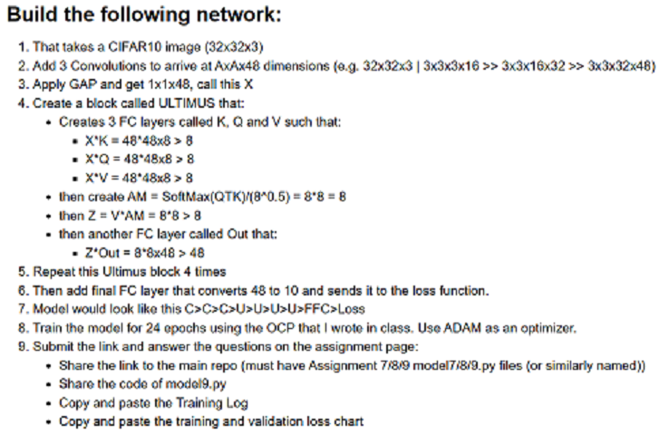
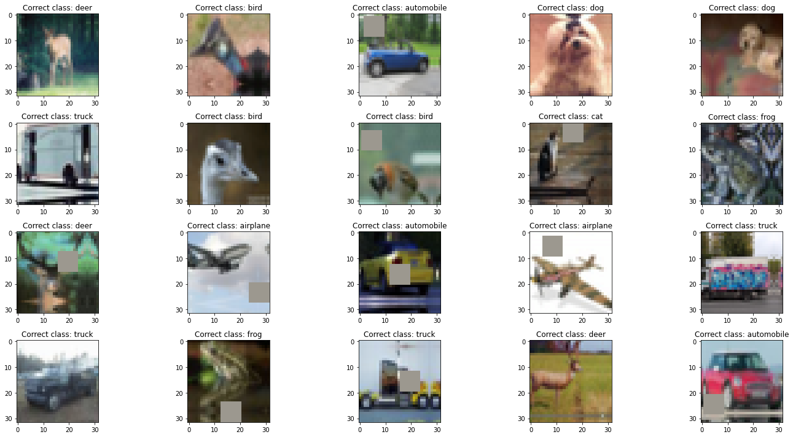
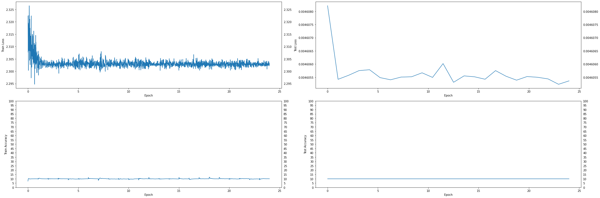
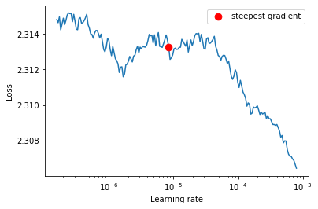
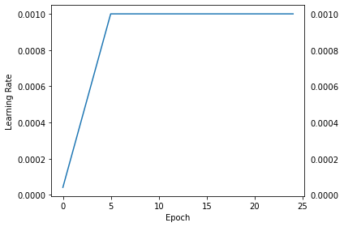
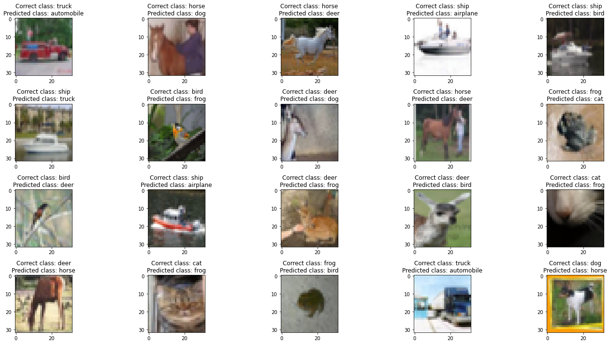

**Student of EVA7 Batch awaiting EVA Phase II submitting EVA8 Transformer Assignments** </br>
Repository github url : https://github.com/jai-mr/Session </br>
Assignment Repository : https://github.com/jai-mr/Session/blob/main/S9/README.md</br>
Submitted by : Jaideep R - No Partners</br>
Registered email id : jaideepmr@gmail.com</br>

**Objective:***</br>


1. **Model9.py Link**</br>
[Model9.py](https://github.com/jai-mr/Session/blob/main/S9/src/models/model9.py)

2. **Jupyter Notebook**</br>
[Jupyter Notebook](https://github.com/jai-mr/Session/blob/main/S9/E8S9.ipynb)


3. **Model Parameters**</br>
```
==============================================================================================================================================================================================
Layer (type (var_name))                  Kernel Shape              Input Shape               Output Shape              Param #                   Mult-Adds                 Trainable
==============================================================================================================================================================================================
UltimusNet (UltimusNet)                  --                        [20, 3, 32, 32]           [20, 10]                  --                        --                        True
├─Conv2d (conv1)                         [3, 3]                    [20, 3, 32, 32]           [20, 16, 32, 32]          448                       9,175,040                 True
├─Conv2d (conv2)                         [3, 3]                    [20, 16, 32, 32]          [20, 32, 32, 32]          4,640                     95,027,200                True
├─Conv2d (conv3)                         [3, 3]                    [20, 32, 32, 32]          [20, 48, 32, 32]          13,872                    284,098,560               True
├─AdaptiveAvgPool2d (avgpool)            --                        [20, 48, 32, 32]          [20, 48, 1, 1]            --                        --                        --
├─UltimusBlock (ultimus1)                --                        [20, 48]                  [20, 48]                  --                        --                        True
│    └─Linear (fc_k)                     --                        [20, 48]                  [20, 8]                   392                       7,840                     True
│    └─Linear (fc_q)                     --                        [20, 48]                  [20, 8]                   392                       7,840                     True
│    └─Linear (fc_v)                     --                        [20, 48]                  [20, 8]                   392                       7,840                     True
│    └─Softmax (softmax)                 --                        [20, 20]                  [20, 20]                  --                        --                        --
│    └─Linear (fc_out)                   --                        [20, 8]                   [20, 48]                  432                       8,640                     True
├─UltimusBlock (ultimus2)                --                        [20, 48]                  [20, 48]                  --                        --                        True
│    └─Linear (fc_k)                     --                        [20, 48]                  [20, 8]                   392                       7,840                     True
│    └─Linear (fc_q)                     --                        [20, 48]                  [20, 8]                   392                       7,840                     True
│    └─Linear (fc_v)                     --                        [20, 48]                  [20, 8]                   392                       7,840                     True
│    └─Softmax (softmax)                 --                        [20, 20]                  [20, 20]                  --                        --                        --
│    └─Linear (fc_out)                   --                        [20, 8]                   [20, 48]                  432                       8,640                     True
├─UltimusBlock (ultimus3)                --                        [20, 48]                  [20, 48]                  --                        --                        True
│    └─Linear (fc_k)                     --                        [20, 48]                  [20, 8]                   392                       7,840                     True
│    └─Linear (fc_q)                     --                        [20, 48]                  [20, 8]                   392                       7,840                     True
│    └─Linear (fc_v)                     --                        [20, 48]                  [20, 8]                   392                       7,840                     True
│    └─Softmax (softmax)                 --                        [20, 20]                  [20, 20]                  --                        --                        --
│    └─Linear (fc_out)                   --                        [20, 8]                   [20, 48]                  432                       8,640                     True
├─UltimusBlock (ultimus4)                --                        [20, 48]                  [20, 48]                  --                        --                        True
│    └─Linear (fc_k)                     --                        [20, 48]                  [20, 8]                   392                       7,840                     True
│    └─Linear (fc_q)                     --                        [20, 48]                  [20, 8]                   392                       7,840                     True
│    └─Linear (fc_v)                     --                        [20, 48]                  [20, 8]                   392                       7,840                     True
│    └─Softmax (softmax)                 --                        [20, 20]                  [20, 20]                  --                        --                        --
│    └─Linear (fc_out)                   --                        [20, 8]                   [20, 48]                  432                       8,640                     True
├─Linear (fc)                            --                        [20, 48]                  [20, 10]                  490                       9,800                     True
==============================================================================================================================================================================================
Total params: 25,882
Trainable params: 25,882
Non-trainable params: 0
Total mult-adds (M): 388.44
==============================================================================================================================================================================================
Input size (MB): 0.25
Forward/backward pass size (MB): 15.78
Params size (MB): 0.10
Estimated Total Size (MB): 16.13
==============================================================================================================================================================================================
```

4. **Training Log**</br>
```
EPOCH = 1 | LR = 0.00023239263803680982 | Loss = 2.30 | Batch = 97 | Accuracy = 9.93: 100%|█| 98/98 [01:50<00:00,  1.13
Test set: Average loss: 0.0046, Accuracy: 1000/10000 (10.00%)

EPOCH = 2 | LR = 0.00042478527607361965 | Loss = 2.30 | Batch = 97 | Accuracy = 9.88: 100%|█| 98/98 [01:38<00:00,  1.01
Test set: Average loss: 0.0046, Accuracy: 1000/10000 (10.00%)

EPOCH = 3 | LR = 0.0006171779141104294 | Loss = 2.30 | Batch = 97 | Accuracy = 10.00: 100%|█| 98/98 [01:37<00:00,  1.01
Test set: Average loss: 0.0046, Accuracy: 1000/10000 (10.00%)

EPOCH = 4 | LR = 0.0008095705521472393 | Loss = 2.31 | Batch = 97 | Accuracy = 9.92: 100%|█| 98/98 [01:41<00:00,  1.04s
Test set: Average loss: 0.0046, Accuracy: 1000/10000 (10.00%)

EPOCH = 5 | LR = 0.001 | Loss = 2.30 | Batch = 97 | Accuracy = 9.73: 100%|█████████████| 98/98 [01:40<00:00,  1.03s/it]
Test set: Average loss: 0.0046, Accuracy: 1000/10000 (10.00%)

EPOCH = 6 | LR = 0.001 | Loss = 2.30 | Batch = 97 | Accuracy = 9.93: 100%|█████████████| 98/98 [01:35<00:00,  1.02it/s]
Test set: Average loss: 0.0046, Accuracy: 1000/10000 (10.00%)

EPOCH = 7 | LR = 0.001 | Loss = 2.30 | Batch = 97 | Accuracy = 9.93: 100%|█████████████| 98/98 [01:40<00:00,  1.03s/it]
Test set: Average loss: 0.0046, Accuracy: 1000/10000 (10.00%)

EPOCH = 8 | LR = 0.001 | Loss = 2.30 | Batch = 97 | Accuracy = 10.00: 100%|████████████| 98/98 [01:37<00:00,  1.00it/s]
Test set: Average loss: 0.0046, Accuracy: 1000/10000 (10.00%)

EPOCH = 9 | LR = 0.001 | Loss = 2.30 | Batch = 97 | Accuracy = 9.74: 100%|█████████████| 98/98 [01:47<00:00,  1.10s/it]
Test set: Average loss: 0.0046, Accuracy: 1000/10000 (10.00%)

EPOCH = 10 | LR = 0.001 | Loss = 2.30 | Batch = 97 | Accuracy = 9.80: 100%|████████████| 98/98 [01:44<00:00,  1.07s/it]
Test set: Average loss: 0.0046, Accuracy: 1000/10000 (10.00%)

EPOCH = 11 | LR = 0.001 | Loss = 2.30 | Batch = 97 | Accuracy = 9.92: 100%|████████████| 98/98 [01:37<00:00,  1.00it/s]
Test set: Average loss: 0.0046, Accuracy: 1000/10000 (10.00%)

EPOCH = 12 | LR = 0.001 | Loss = 2.30 | Batch = 97 | Accuracy = 9.90: 100%|████████████| 98/98 [01:40<00:00,  1.03s/it]
Test set: Average loss: 0.0046, Accuracy: 1000/10000 (10.00%)

EPOCH = 13 | LR = 0.001 | Loss = 2.30 | Batch = 97 | Accuracy = 9.85: 100%|████████████| 98/98 [01:46<00:00,  1.08s/it]
Test set: Average loss: 0.0046, Accuracy: 1000/10000 (10.00%)

EPOCH = 14 | LR = 0.001 | Loss = 2.30 | Batch = 97 | Accuracy = 9.96: 100%|████████████| 98/98 [01:40<00:00,  1.02s/it]
Test set: Average loss: 0.0046, Accuracy: 1000/10000 (10.00%)

EPOCH = 15 | LR = 0.001 | Loss = 2.30 | Batch = 97 | Accuracy = 9.74: 100%|████████████| 98/98 [01:36<00:00,  1.02it/s]
Test set: Average loss: 0.0046, Accuracy: 1000/10000 (10.00%)

EPOCH = 16 | LR = 0.001 | Loss = 2.30 | Batch = 97 | Accuracy = 9.86: 100%|████████████| 98/98 [01:38<00:00,  1.00s/it]
Test set: Average loss: 0.0046, Accuracy: 1000/10000 (10.00%)

EPOCH = 17 | LR = 0.001 | Loss = 2.30 | Batch = 97 | Accuracy = 9.93: 100%|████████████| 98/98 [01:36<00:00,  1.01it/s]
Test set: Average loss: 0.0046, Accuracy: 1000/10000 (10.00%)

EPOCH = 18 | LR = 0.001 | Loss = 2.30 | Batch = 97 | Accuracy = 9.93: 100%|████████████| 98/98 [01:38<00:00,  1.00s/it]
Test set: Average loss: 0.0046, Accuracy: 1000/10000 (10.00%)

EPOCH = 19 | LR = 0.001 | Loss = 2.30 | Batch = 97 | Accuracy = 9.86: 100%|████████████| 98/98 [01:38<00:00,  1.00s/it]
Test set: Average loss: 0.0046, Accuracy: 1000/10000 (10.00%)

EPOCH = 20 | LR = 0.001 | Loss = 2.30 | Batch = 97 | Accuracy = 10.01: 100%|███████████| 98/98 [01:38<00:00,  1.00s/it]
Test set: Average loss: 0.0046, Accuracy: 1000/10000 (10.00%)

EPOCH = 21 | LR = 0.001 | Loss = 2.30 | Batch = 97 | Accuracy = 9.80: 100%|████████████| 98/98 [01:53<00:00,  1.16s/it]
Test set: Average loss: 0.0046, Accuracy: 1000/10000 (10.00%)

EPOCH = 22 | LR = 0.001 | Loss = 2.30 | Batch = 97 | Accuracy = 10.02: 100%|███████████| 98/98 [01:37<00:00,  1.00it/s]
Test set: Average loss: 0.0046, Accuracy: 1000/10000 (10.00%)

EPOCH = 23 | LR = 0.001 | Loss = 2.30 | Batch = 97 | Accuracy = 9.75: 100%|████████████| 98/98 [01:38<00:00,  1.01s/it]
Test set: Average loss: 0.0046, Accuracy: 1000/10000 (10.00%)

EPOCH = 24 | LR = 0.001 | Loss = 2.30 | Batch = 97 | Accuracy = 10.00: 100%|███████████| 98/98 [01:42<00:00,  1.05s/it]
Test set: Average loss: 0.0046, Accuracy: 1000/10000 (10.00%)
```

5. Training Details</br>
i. 
ii. 

6. **Training and Validation Loss Chart**</br>


7. **LR Finder Graph**</br>


8. **LR History**</br>


9. **Misclassified Images**</br>

